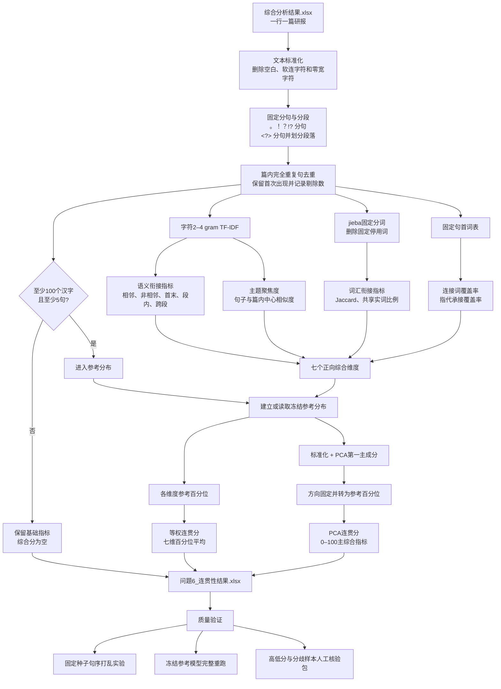

# 问题6：研报文本连贯性

本问题把“前后句是否接得上、全文是否围绕同一主题、是否用连接和指代承接”转成可复跑指标。
它测量文本表面的衔接与语义连续性，不直接判定论证正确、事实可靠或文章质量。

## 一、方案选择

需求文档建议 Coh-Metrix、PCA 和 `l2c-cohesion`。本项目采用透明指标加冻结 PCA：

- Coh-Metrix 的公开实现主要面向英文，且仍有注册或许可环节；
- [`l2c-cohesion`](https://github.com/mybluue/l2c-cohesion) 的中文局部／整体衔接指标值得借鉴，
  但运行依赖固定版本 LTP 及较大的句法语义模型；
- 当前 17,712 篇研报去重后共有 301,011 句，中位篇长约 15 句，核心是相邻句的局部连续性，
  无需用面向超长训练语料筛选的黑箱分类模型。

本实现没有在线模型调用、提示词或人工随机步骤。同一输入和冻结参考模型会得到同一数值。

## 二、计算流程



图中“七个正向综合维度”包括语义局部超额、词汇局部超额、相邻共享实词比例、
主题聚焦度、显式连接覆盖率、指代承接覆盖率和非零语义转移比例。

1. 删除空白、软连字符和零宽字符；以 `。！？!?` 分句，以 `<?>` 同时分句和划分段落。
2. 同篇完全相同的句子只保留第一次，避免抓取或拼接重复虚高衔接，并记录剔除数量。
3. 在全语料句子上拟合字符 2–4 gram TF-IDF（`min_df=5`，最多 50,000 维，L2 标准化）。
4. 计算相邻句、非相邻句、首末句、段内与跨段的余弦相似度。
5. 用固定 jieba 分词、固定停用词表计算相邻句实词集合 Jaccard 与共享实词比例。
6. 用固定词表识别句首连接词和句首指代承接词。
7. 原始指标固定保留 7 位小数，消除不同稀疏矩阵路径的机器末位浮点差异。
8. 至少 100 个汉字且至少 5 句的研报进入参考分布；其余保留基础指标，综合分为空。
9. 七个正向指标先计算语料百分位，其平均值为等权分。七个原始指标标准化后做 PCA，
   第一主成分方向固定为与等权分正相关，再转成 0–100 的参考分位数。
10. 保存 `reference.joblib`。新数据加 `--reference` 后不会重新拟合词表、IDF、PCA 或分位数。

综合分使用：`语义局部超额`、`词汇局部超额`、`相邻共享实词比例`、`主题聚焦度`、
`显式连接覆盖率`、`指代承接覆盖率`、`非零语义转移比例`。
首末句相似度单独保留，不进入综合分，因为研报首句常是评级摘要、末句常是风险提示。

## 三、公式

设一篇研报有句子 `s1…sn`，TF-IDF 向量均已 L2 标准化：

- 相邻语义：`mean(cos(si, s(i+1)))`；
- 非相邻语义：所有距离至少 2 的句对余弦均值；
- 语义局部超额：`相邻语义 − 非相邻语义`；
- 词汇 Jaccard：`|Ti ∩ Tj| / |Ti ∪ Tj|`，T 是去固定停用词后的至少两个汉字词集合；
- 词汇局部超额：相邻 Jaccard 均值减非相邻 Jaccard 均值；
- 主题聚焦度：每句与该篇平均 TF-IDF 向量的余弦均值；
- 覆盖率：第 2 句至末句中，以固定连接词／指代词开头的句数除以 `n−1`；
- 等权连贯分：七个维度的语料百分位平均；
- PCA 连贯分：七维标准化后第一主成分的语料百分位，越高表示相对衔接越强。

百分位是本批语料中的相对位置。50 表示约处于样本中间，不是“50% 正确”或“及格”。

## 四、结果表每一列的意义

`问题6_连贯性结果.xlsx` 一行对应源 Excel 一篇研报，行序不变。

| 列名 | 意义 |
|---|---|
| 源Excel行号 | 原始工作表实际行号；用于可靠回连，源“序号”不唯一 |
| fordate | 源数据报告日期 |
| 序号 | 源数据原有序号，仅保留，不作为主键 |
| stkcd | 源数据股票代码 |
| 公司简称 | 源数据公司简称 |
| 证券公司 | 源数据出具机构 |
| 计算状态 | `可比较`、`短文本_不进入参考分布` 或 `空白或占位文本` |
| 有效汉字数 | 清洗后汉字数量，用于短文本门槛 |
| 重复句数_已剔除 | 同篇完全相同、只保留第一次的句子数量 |
| 句数 | 固定规则切分并去除完全重复句后的含汉字句子数 |
| 段数 | `<?>` 划分后实际含句子的段落数 |
| 相邻转移数 | 可比较的前后句对数，即句数减 1 |
| 相邻句语义相似度 | 所有前后相邻句 TF-IDF 余弦均值 |
| 非相邻句语义相似度 | 间隔至少一句的全部句对余弦均值 |
| 语义局部超额 | 相邻语义减非相邻语义；正值表示邻句比远句更接近 |
| 零语义转移比例 | 相邻句字符 n-gram 完全无重合的句对占比 |
| 相邻句词汇Jaccard | 相邻句实词集合 Jaccard 均值 |
| 非相邻句词汇Jaccard | 非相邻句实词集合 Jaccard 均值 |
| 词汇局部超额 | 相邻词汇 Jaccard 减非相邻词汇 Jaccard |
| 相邻共享实词比例 | 至少共享一个内容词的相邻句对占比 |
| 主题聚焦度 | 每句与篇内平均 TF-IDF 向量的余弦均值 |
| 首末句语义相似度 | 第一有效句和最后有效句的余弦相似度 |
| 段内相邻语义相似度 | 位于同一 `<?>` 段内的相邻句余弦均值 |
| 跨段相邻语义相似度 | 跨越 `<?>` 的相邻句余弦均值；无跨段句对时为空 |
| 显式连接覆盖率 | 后续句以固定连接词开头的比例 |
| 指代承接覆盖率 | 后续句以固定指代／回指词开头的比例 |
| 等权连贯分 | 七个维度百分位的等权平均，0–100，作为稳健性对照 |
| PCA原始分 | 冻结 PCA 第一主成分值；用于复现诊断，不宜跨参考模型比较 |
| PCA连贯分 | PCA 原始分在冻结参考语料中的百分位，0–100，建议作为主综合指标 |

空白和 0 不同：空白表示句数不足而无法定义；0 表示可定义但没有观察到相应衔接。

## 五、输出文件

| 文件 | 用途 | 是否入库 |
|---|---|---|
| `问题6_连贯性结果.xlsx` | 17,712 篇逐篇指标 | 是 |
| `reference.joblib` | 冻结 TF-IDF、标准化器、PCA、分位参考值和版本 | 是 |
| `summary.json` | 样本量、指标中位数、PCA 载荷和打乱检验摘要 | 是 |
| `shuffle_validation.json` | 句序打乱实验的聚合结果 | 是 |
| `shuffle_validation_rows.csv` | 500 篇打乱实验逐篇结果 | 是 |
| `句际转移证据.jsonl` | 一行一个相邻句对，约 57 MB，可重建 | 否 |
| `连贯性人工核验样本.csv` | 高低分、分歧样本和文本片段，供盲评 | 否，含原文 |
| `manifest.json` | 输入、参考模型和产出 SHA256 | 是 |
| `verification.json` | 自动检查与冻结参考重跑结果 | 是 |

## 六、全量结果与有效性检查

共处理 17,712 篇、去重后 301,011 句：17,569 篇进入参考分布，99 篇为短文本，
44 篇为空白或占位文本。757 篇存在完全重复句，共剔除 2,194 句。
PCA 第一主成分解释 32.17% 的七维标准化方差，所有定向后载荷均为正。

固定抽取 500 篇、每篇按源行号为种子打乱 10 次。原文相邻语义相似度均值 0.0680，
打乱后 0.0399，原文更高占 92.2%；原文相邻词汇 Jaccard 均值 0.0630，打乱后 0.0364，
原文更高占 93.4%。语义和词汇“局部超额”在打乱后都接近 0。
这说明指标确实响应句子顺序，但仍需人工盲评才能证明它与人的整体判断一致。

## 七、运行与复现

```bash
cd problem6_连贯性
pip install -r requirements.txt
python -m unittest -v test_problem6.py
python problem6_coherence.py

# 对新数据使用冻结参考尺度
python problem6_coherence.py --input 新数据.xlsx --output-dir 新输出 \
  --reference output/reference.joblib
```

输入文件、程序、参考模型和主要依赖版本一致时可复现；摘要或版本写入 `manifest.json` 与
`reference.joblib`。脚本只读取根目录原始 Excel，不依赖问题1–5的输出。

## 八、限制

- TF-IDF 是字符片段重合形成的语义代理，不等于深层语义或因果逻辑；
- 连接与指代只识别固定句首形式，召回率有限，但定义稳定、可审计；
- 重复套话可能抬高主题聚焦和词汇衔接，应结合问题3复杂性指标和原文复核；
- PCA 载荷取决于冻结参考语料；跨样本比较必须复用同一参考模型；
- 当前综合分尚未与多人盲评做相关性或一致性检验，不能称为人工准确率。

方法背景：[LongWanjuan](https://arxiv.org/abs/2402.13583)、
[l2c-cohesion](https://github.com/mybluue/l2c-cohesion)、
[CohMetrixCore](https://github.com/mkclairhong/cohmetrix)。
