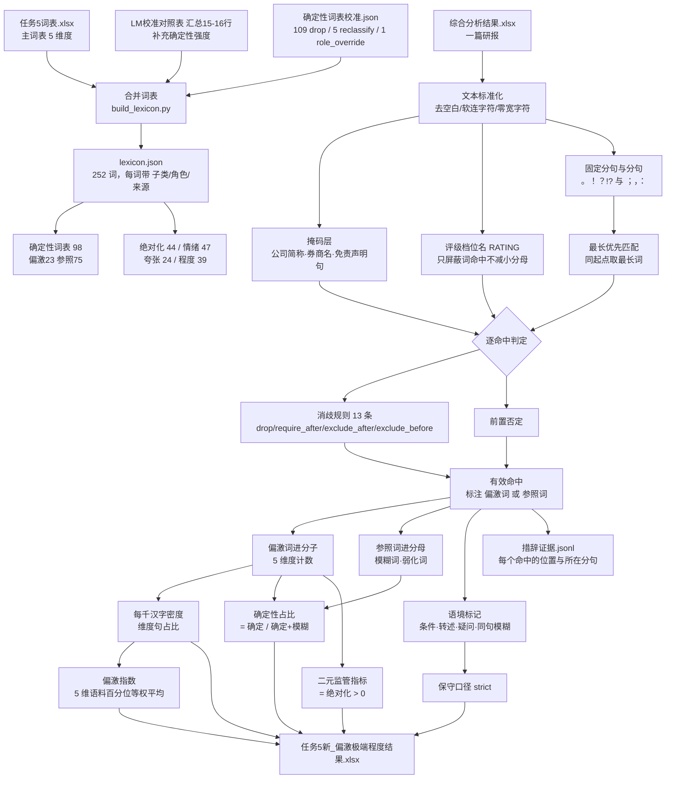

# 任务5（新）：研报语言偏激与极端程度

本文件夹是**独立于 `problem5_偏激极端程度/` 的第二版**，按两份新词表重做：
`任务5词表.xlsx`（主种子词表，5 维度）与 `LM词表中文校准对照表.xlsx`
的「汇总」表第 15–16 行（补充「确定性强度」）。原 `problem5` 文件夹未做任何改动。

本任务测量**文本表面的措辞强度**，不判定观点正确、不预测评级、不评价研究质量。

## 一、怎么做

### 1. 词表合并（`build_lexicon.py`）

主词表 185 词条按维度直接读入；LM 只取「汇总」表第 15 行（确定性词/强断言）
与第 16 行（模糊词/不确定），共补充 57 个模糊词与 8 个确定性词。

单元格内以顿号分隔、以斜杠并列的条目（如「一定/确定」）按并列拆开——
**这一条拆分规则引入了一处错误**：「最佳/最好」被拆出「最好」并列入了
确定性词，但「最好」义为 best。已在校准中修正（见下）。

### 2. 确定性词表逐词校准（`resources/确定性词表校准.json`）

LM 的模糊词列表是**英文不确定性词表的机器直译**，直接并入会让「确定性占比」
失去意义。校准共处置 115 个词，每条都给出本语料的实测依据：

| 处置 | 词数 | 说明与依据 |
|---|---|---|
| drop | 109 | 从词表移除，明细与逐词理由见校准文件 |
| reclassify | 5 | 改判到「绝对化/最高级」（无与伦比的、无出其右的、毫不含糊的、毫不含糊、无可争议的） |
| role_override | 1 | `一定`：在原维度内由偏激词改为参照词 |

drop 的主要类别及其实测依据：

| 类别 | 例词 | 依据 |
|---|---|---|
| 名词，非不确定限定语 | 风险(18,859)、变化、波动、变动、波动率、敞口 | LM 把 risk/variance/volatility/exposure 直译进来 |
| 情态动词／助动词 | 可以(4,354)、能够(2,573)、应当(451) | 表许可或义务，不表不确定 |
| 频率与时间副词 | 经常(1,062)、通常、定期、频繁、总是、始终 | 表频次不表不确定 |
| 立场与示证动词 | 认为(11,629)、表明(996)、依赖、暴露、澄清 | 研报中作断言而非模糊限定 |
| **意思相反** | 明显的(680) | 表「确定」而非「不确定」，被 LM 误置于模糊词列 |
| 英文 un-/in- 前缀派生词 | 未对冲的、未对账的、不可量化的、无限期的 | 42 个词全库零命中，是英文形态学的机械直译 |
| 名词作形容词 | 预期(27,636)、上下(770) | 「预期」前置「低于/符合/市场/不达/不及」占 13,853 次（过半）为名词；「上下」83% 后接「游」即「上下游产业链」 |

`一定` 的改判依据：全库 4,398 次中 31% 为「一定程度/一定影响/一定压力/一定幅度」，
后置最高频字是「的」（「一定的X」1,312 次）也是模糊量词；**强断言读法
「一定能/会/要」仅 54 次（1%）**。LM 按 certain/certainly 直译，与中文实际用法相反。

### 3. 短词消歧（`resources/disambiguation.json`，13 条规则）

单字与易歧义双字按语料实测的后续/前置字分布约束，四个动作：
`drop`（不参与计分）、`exclude_after`（后接指定字则丢弃）、
`require_after`（仅后接指定字才计入）、`exclude_before`（前置指定字则丢弃）。

| 词 | 规则 | 依据 |
|---|---|---|
| 超 | require_after 预 | 全库 20,719 次中 超过/超出/超市/超募/超越/超超临界/超硬材料 均为误匹配；2009–2016 研报里只有「超预期」是真实用法 |
| 略 | require_after 15 字 | 战略/策略/方略 贡献绝大部分命中 |
| 最 | exclude_after 14 字 | 最终/最新/最后/最近 是时间词；最大/最高/最好等已另有独立词条 |
| 极 | exclude_after 6 字 + **exclude_before 积** | 前置「积」构成「积极探索/参与/关注」是最集中的误匹配源；后置排除 极性/极板 |
| 剧 | exclude_after 10 字 + **exclude_before 加** | 前置「加」构成「加剧」，属程度动词而非程度副词 |
| 所有 | exclude_after 者/权 | 全库 2,301 次中 1,187 次（52%）是「所有者」（归属母公司所有者），是会计术语 |
| 将 会 或 | drop | 语法连接词，无强断言/模糊限定用法 |

### 4. 评级档位名掩码（`score_extremity.py` 的 `RATING`）

词表里的「强烈」「谨慎」在评级名中是**档位**而非措辞：
「强烈」2,595 次中 1,969 次（75.9%）、「谨慎」2,407 次中 1,667 次（69.3%）
后接即评级档位（推荐/增持/买入…）。全库共剔除 3,694 次。

**掩码只屏蔽词命中，不减少有效汉字数**——否则分母会随词表变化，
破坏「有效汉字数是文本属性」这一前提与跨版本可比性。

### 5. 判据是区间相交，不是邻近

掩码判据为「命中区间与评级名区间相交」。若改判近邻（±6 字），
「维持强烈推荐，看好公司」里的「看好」会被误伤。

### 6. 两套口径

主口径 `active`：只排除上述确定的误匹配。保守口径 `strict`：再排除带语境标记的命中
（同分句含模糊词、条件表达、疑似转述、疑问句），用于稳健性对照。

## 二、计算流程



## 三、测度定义

依词表自带的《使用说明》：

1. **比例法（主结果）**：某维度词出现次数 ÷ 有效汉字数 × 1000；
2. **二元指标（监管视角）**：是否含「绝对化/最高级」用语，只看该维度，
   不与其他维度混合；
3. **参照词比率**：确定性占比 = 确定 / (确定 + 模糊)；
   程度加强净额 = 程度加强密度 − 弱化词密度；
4. **偏激指数**：5 个维度密度在语料中的百分位，等权平均。

**偏激词与参照词严格分列分子与分母。** 模糊词、弱化词是分母与对照，
不进入任何维度的分子。

百分位是本批语料中的**相对位置**：中位数 49.0 表示约处于样本中间，
不是「49% 偏激」。等权是透明的设计选择，不是估计出的最优权重。

## 四、结果

全量 17,712 篇：17,623 篇可计算，45 篇短文本，44 篇空白或占位文本。

| 维度 | 命中次数 | 涉及研报 | 占比 | 命中 Top5 |
|---|---:|---:|---:|---|
| 确定性强度 | 5,130 | 3,460 | 19.5% | 确定2,182 明确1,557 必然381 必须280 无疑279 |
| 绝对化/最高级 | 29,896 | 11,424 | 64.5% | 龙头5,762 第一4,136 最3,467 最大3,458 全面3,038 |
| 情绪极端度 | 3,898 | 2,546 | 14.4% | 爆发2,151 翻番495 翻倍481 腾飞179 极佳77 |
| 夸张修辞度 | 919 | 651 | 3.7% | 垄断769 王者79 裂变17 开挂11 爆炸式8 |
| 程度加强度 | 36,419 | 12,986 | 73.3% | 大幅14,843 显著3,948 超3,600 巨3,379 极2,736 |

- **二元监管指标**：11,424 篇（64.5%）含绝对化或最高级用语；
- **偏激指数**：P25 = 42.5，中位 = 49.0，P75 = 57.1；
- 零命中词 42 个（17%），保留在词表中并随产出记录，不影响计分。

### 一个必须说清的结果：确定性维度在本语料中天然稀疏

**确定性占比中位数为 0，80%（13,877/17,337）的研报该比值为 0**，
均值仅 4.74%。这不是计算错误：

- 全库含「确定」二字的研报只有 2,777 篇（15.7%）；
- 强断言词（必然/必须/无疑/势必/注定/板上钉钉…）合计仅 5,130 次，
  而模糊词 105,111 次，相差约 20 倍；
- 校准中 `一定` 的强断言读法只占 1%，是这一现象的缩影。

**结论：中文卖方研报系统性地避免使用强断言措辞，改用「预计/预期/可能」
等模糊限定。** 这本身是有价值的研究发现，但也意味着：
按篇比较「确定性占比」意义有限，建议在**汇总层面**使用，
或改用密度类绝对指标（确定性词密度）。

## 五、输出文件

| 文件 | 用途 | 是否入库 |
|---|---|---|
| `任务5新_偏激极端程度结果.xlsx` | 17,712 篇 × 34 列逐篇指标 | 是 |
| `summary.json` | 样本量、状态分布、各维度与参照词总量 | 是 |
| `manifest.json` | 输入、脚本、词表、消歧、证据、指标的 SHA256 | 是 |
| `逐篇指标.json` | 与 Excel 同源的完整逐篇记录（便于程序读取），约 17 MB | 否，可由脚本重建 |
| `措辞证据.jsonl` | 一行一个命中，约 82 MB，含位置与所在分句，可重建 | 否 |
| `resources/lexicon.json` | 合并后词表（含每词的子类/角色/来源） | 是 |
| `resources/确定性词表校准.json` | 115 词的处置与依据 | 是 |
| `resources/disambiguation.json` | 13 条短词消歧规则与依据 | 是 |
| `resources/*.xlsx` | 两份来源词表 | 是 |

### 结果表每一列的意义

`任务5新_偏激极端程度结果.xlsx` 一行对应源 Excel 一篇研报，**行序不变**。

| 列名 | 意义 |
|---|---|
| 源Excel行号 | 原始工作表实际行号；用于可靠回连，源「序号」不唯一 |
| fordate / 序号 / stkcd / 公司简称 / 证券公司 | 源数据原样保留 |
| 计算状态 | `可计算` / `短文本_谨慎比较` / `占位文本` / `空白或无汉字` |
| 有效汉字数 | 清洗并去掉公司名、免责声明句后剩余的汉字数；**密度类指标的分母** |
| 有效句数 | 固定规则切分的含汉字句数 |
| {维度}\_次数 | 该维度**偏激词**的有效命中次数（不含参照词） |
| {维度}\_密度 | 次数 ÷ 有效汉字数 × 1000 |
| {维度}\_句占比 | 含该维度命中的句数 ÷ 有效句数（同句多次命中只算一次） |
| 情绪极端度\_积极密度 / 消极密度 | 情绪维度按子类拆分的密度 |
| 模糊词\_次数 / 密度 | 「确定性强度」维度中**参照词**（模糊词）的量 |
| 弱化词\_次数 / 密度 | 「程度加强度」维度中**参照词**（弱化词）的量 |
| 确定性占比 | 确定次数 ÷ (确定次数 + 模糊词次数)；分母为 0 时留空 |
| 程度加强净额 | 程度加强密度 − 弱化词密度 |
| 含绝对化或最高级 | 二元监管指标：该维度命中 > 0 记为 1，否则 0 |
| 偏激指数 | 5 个维度密度的语料百分位等权平均，0–100 |

**空白与 0 不同**：空白表示分母为 0 而无法定义；0 表示可定义但没有观察到。

## 六、质量验证

**做了：**

- 22 项自动测试（`python -m unittest -v test_problem5new.py`）全部通过，
  覆盖词表一致性、消歧规则正反例、评级掩码的反例（「强烈看好」须保留）、
  免责声明掩码的邻句隔离、分子分母角色不混、行号连续无重复、manifest 哈希齐全；
- **全量 diff**：校准前后逐行比对 17,712 篇，确认变化仅出现在词表相关字段，
  **有效汉字数与计算状态 0 行变化**；
- **反向验证**：被移除的 109 个词已无任何一条残留在证据文件中；
- **正向验证**：评级掩码剔除 3,694 次，剔除样例逐条核对
  （`谨慎`←「维持"谨慎推荐"」✓ ，`强烈` 存活 629 次真实用法 ✓）；
- **定向量化后再决策**：每个排除规则都先测语料分布、再定阈值，
  不做「看起来不对就删」；
- **复现性**：同一输入重跑，`措辞证据.jsonl` 与 `逐篇指标.json` 的 SHA256 字节级一致。
- 验证过程中发现并修复一处**表头缺列**：`偏激指数` 的列名在写入表头之后才被追加，
  导致该列在 Excel 中无表头（数据列 34、表头列 33），已修正为 34 列齐全。

**没做：**

- **无人工效度验证**，因此**不报告任何准确率**。「偏激指数」是否真的对应
  读者感知的偏激程度，需要盲评才能回答；
- 未做跨词表版本的一致性检验。本任务与 `problem5` 的词表、消歧规则、
  掩码范围均不同，**两套产出不可直接比较**。

**已知的开放问题：**

- `垄断`（769 次）被主词表列为「夸张修辞」，但它在本语料的搭配是
  「垄断地位/垄断优势/垄断格局/寡头垄断」，属产业组织术语而非修辞夸张。
  这是**分类问题而非匹配错误**，属作者对主词表的判断，本次未改动，提请复核。

## 七、运行与复现

```bash
cd "任务5（新）"
python build_lexicon.py     # 合并词表并应用校准 → resources/lexicon.json
python score_extremity.py   # 全量计分 → output/
python -m unittest -v test_problem5new.py
```

输入、脚本、词表、消歧规则与依赖版本一致时可复现；哈希写入 `manifest.json`。
脚本只读取根目录的 `综合分析结果.xlsx`，不依赖任何其它问题的产出。

**复核某个排除决定**：把该词从 `resources/确定性词表校准.json` 的
`drop`/`reclassify`/`role_override` 中删掉，或从
`resources/disambiguation.json` 中删掉对应规则，重跑上面两条命令即可恢复，
其余结果不变。

## 八、限制

- 词典法是**词面代理**，不识别反讽、引述他人观点、否定范围等深层语义；
- 消歧规则依据本语料（2009–2016 年 A 股研报）的经验分布，
  **迁移到其它语料需重新测定**；
- 词表零命中词 42 个（如 碾压/史诗级/破圈/逆天/病毒式），是现代网络用语，
  不可能出现在本语料中，保留仅为词表完整性；
  （另有一组**同为 42 个**的零命中词来自 LM 的英文前缀直译，两者是不同的集合）
- 「确定性占比」存在地板效应（80% 为 0），逐篇比较意义有限；
- 源 Excel 存在被换列截断的词（如「评级」只剩「评」、词间插入空格），
  长短不一的截断使这部分文本**无法被词表匹配**，其损失不体现在任何指标中；
  截断率的准确估计需要与原始研报对比，本任务未做。
